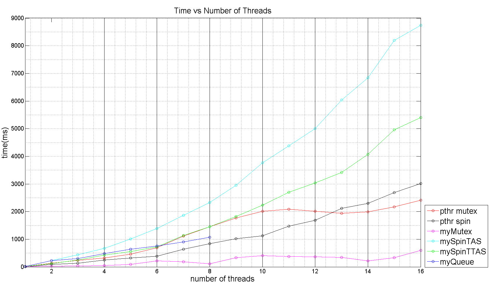

# Lock Implementations in C
The goal of this project is to examine the efficiency and the implicit relationships between locks
and number of threads and work done inside and outside critical section.

Besides the Linux built-in pthread mutex and pthread spinlock, in sync.h/.c there are also my own version of spinlocks (using Test-and-Set and Test-and-Test-and-Set), mutex (exponential-back off), and queue lock.

Data are collected and outputted in the Time_data sub-directory and then are analyzed and plotted using MATLAB scripts.   

